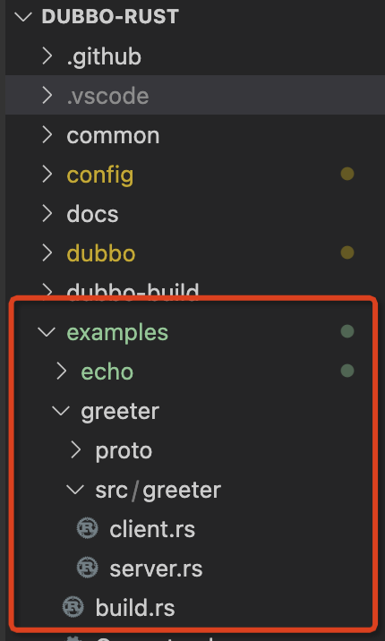
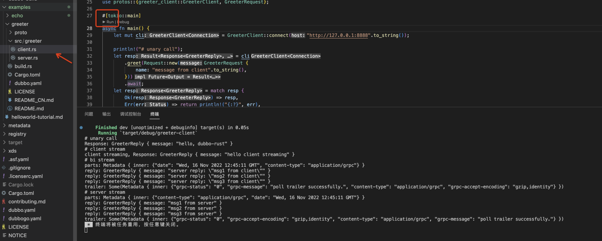

# 使用VS Code 运行 Dubbo-rust

#### 首先我们拉下 Dubbo-rust 项目
```shell
git clone https://github.com/apache/dubbo-rust.git
```
#### 打开编辑器准备启动项目
打开对应的 **Dubbo-rust** 项目
在当前目录下创建一个新文件夹，名称为 **.vscode**

```shell
mkdir .vscode
```

创建个json文件，名称为launch.json，该文件 **.vscode** 目录下 将下文的内容复制到launch.json中

```json
{
    // Use IntelliSense to learn about possible attributes.
    // Hover to view descriptions of existing attributes.
    // For more information, visit: https://go.microsoft.com/fwlink/?linkid=830387
    "version": "0.2.0",
    "configurations": [
        {
            "type": "lldb",
            "request": "launch",
            "name": "greeter-server",
            "program": "${workspaceFolder}/target/debug/greeter-server",
            "args": [],
            "cwd": "${workspaceFolder}/examples/greeter/",
            "terminal": "console",
            "env": { }
        },
        {
            "type": "lldb",
            "request": "launch",
            "name": "greeter-client",
            "program": "${workspaceFolder}/target/debug/greeter-client",
            "args": [],
            "cwd": "${workspaceFolder}/examples/greeter/",
            "terminal": "console",
            "env": {}
        },
    ]
}
```

#### 打开 examples/greeter/src/greeter 目录，选择server.rs



#### 选择左侧的运行按钮，启动 server 服务


##### 启动 client 访问server 端


